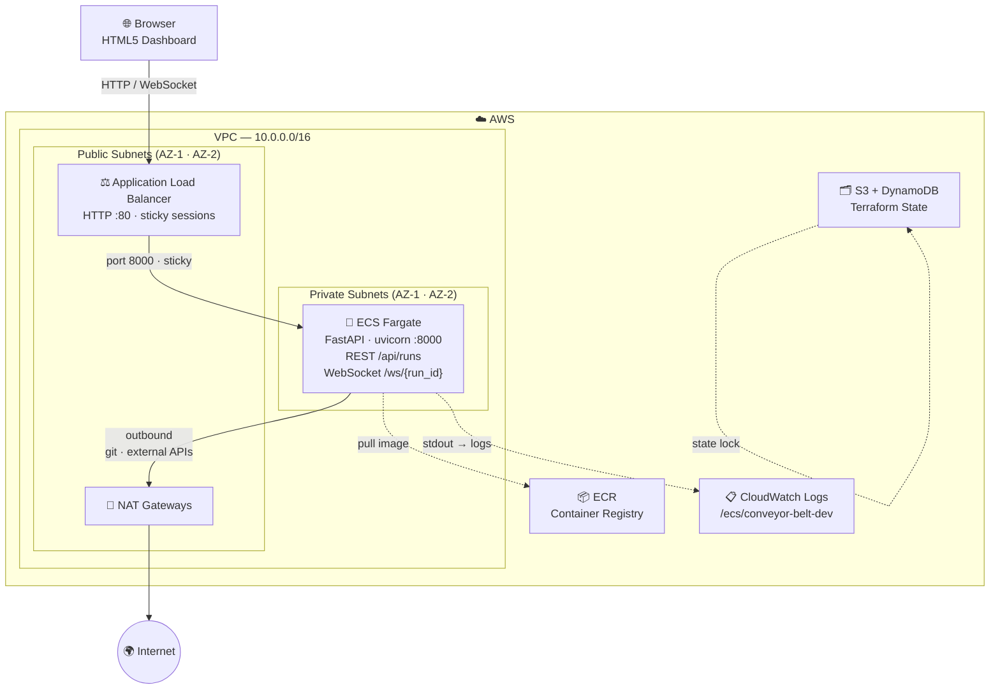

# Conveyor Belt

Agentic conveyor-belt QA pipeline for code check-ins.

[](https://github.com/atkurukrishna/conveyor-belt/actions)

---

## Architecture



### Components

| Component | Purpose |
|---|---|
| **ALB** | Public entry point; terminates HTTP, upgrades WebSocket connections, sticky sessions keep each browser pinned to the same task |
| **ECS Fargate** | Runs the FastAPI app (`conveyor_belt.server`); no servers to manage |
| **ECR** | Private container registry; `scan_on_push` enabled |
| **NAT Gateways** | Allow tasks in private subnets to reach GitHub, LLM APIs, Snyk, etc. — one per AZ to avoid cross-AZ traffic costs |
| **CloudWatch Logs** | All task stdout/stderr, 30-day retention |
| **S3 + DynamoDB** | Remote Terraform state with row-level locking |

> **Sticky sessions** are required because WebSocket connections and in-memory pipeline run state both live on the same task. When running `desired_count > 1` this prevents a browser from being routed to a different task mid-run.

---

## Quick Start

```bash
# Install
poetry install

# Run QA pipeline against a PR
cb run --pr 42

# Run against a local diff
cb run --diff HEAD~1

# Validate config
cb validate-config
```

---

## Visual Dashboard

```bash
# Start the web UI (defaults to http://127.0.0.1:8000)
cb serve

# Custom host/port, with auto-reload for development
cb serve --host 0.0.0.0 --port 9000 --reload
```

Open the URL in a browser to see the real-time conveyor belt dashboard. Click **🎬 Demo** to watch a scripted pipeline run without needing a live repo.

---

## Deploy to AWS

### Prerequisites
- AWS CLI configured (`aws configure`)
- Terraform ≥ 1.7
- Docker

### 1 — Bootstrap Terraform state

```bash
# Create the S3 bucket
aws s3api create-bucket \
  --bucket my-conveyor-belt-tfstate \
  --region us-east-1

# Create the DynamoDB lock table
aws dynamodb create-table \
  --table-name my-conveyor-belt-tfstate-lock \
  --attribute-definitions AttributeName=LockID,AttributeType=S \
  --key-schema AttributeName=LockID,KeyType=HASH \
  --billing-mode PAY_PER_REQUEST \
  --region us-east-1
```

Then update `infra/terraform/backend.tf` with the bucket and table names.

### 2 — Configure variables

```bash
cp infra/terraform/terraform.tfvars.example infra/terraform/terraform.tfvars
# Edit terraform.tfvars to set your region, environment, etc.
```

### 3 — Provision infrastructure

```bash
cd infra/terraform
terraform init
terraform plan
terraform apply
```

### 4 — Build and push the Docker image

```bash
# Grab ECR URL from Terraform output
ECR_URL=$(terraform output -raw ecr_repository_url)

# Authenticate Docker to ECR
aws ecr get-login-password --region us-east-1 \
  | docker login --username AWS --password-stdin "$ECR_URL"

# Build and push
docker build -t "$ECR_URL:latest" .
docker push "$ECR_URL:latest"
```

### 5 — Deploy the new image

```bash
CLUSTER=$(terraform output -raw ecs_cluster_name)
SERVICE=$(terraform output -raw ecs_service_name)

aws ecs update-service \
  --cluster "$CLUSTER" \
  --service "$SERVICE" \
  --force-new-deployment \
  --region us-east-1
```

The app will be reachable at the URL printed by `terraform output app_url`.

---

## CI/CD Integrations

Pre-built adapters live in `ci_adapters/` for GitHub Actions, CircleCI, Jenkins, and Bazel.
See [`INTEGRATION.md`](INTEGRATION.md) for setup instructions.
